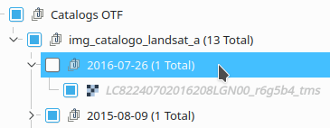
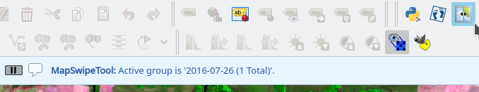
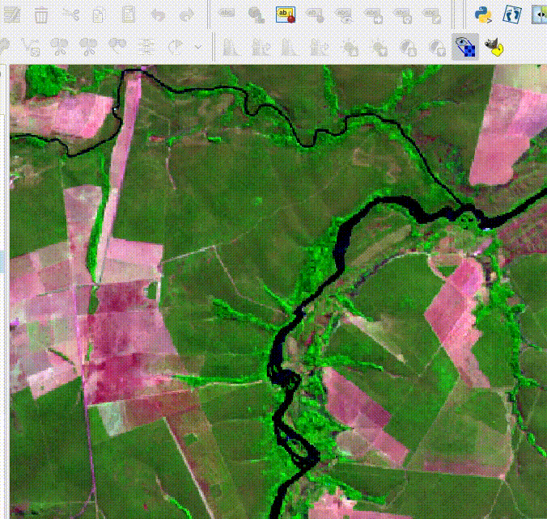

# MapSwipe Tool Plugin  

***MapSwipe Tool*** is a tool to make a layer or a group as a curtain above all layers of the map view.  

The ***MapSwipe Tool*** can work horizontally or vertically, where, the direction of movement of mouse define the direction type.  

## Steps: ##  

* **Define a layer or a group for MapSwipe Tool :**  
Select a layer or a group annd active the tool.
  
  

* **Move the tool in map view :**  
Click and hold the left button of mouse, move its in the direction you want.  
  
